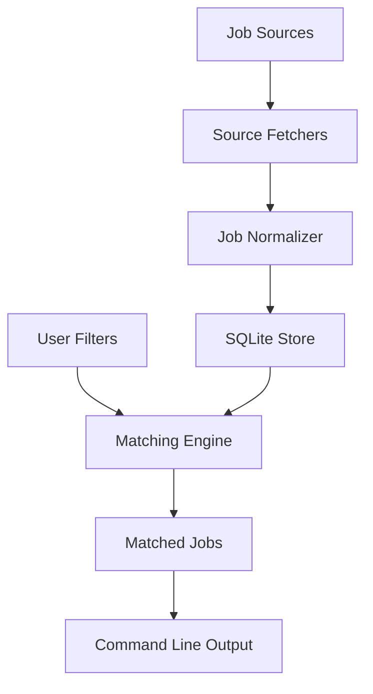

# JobFinder Architecture

JobFinder is organized around source adapters, normalization, local persistence, and filtering.

## Components

### Source Adapters

Source adapters know how to fetch jobs from a specific job source. Each adapter returns normalized `JobPosting` records so the rest of the system does not depend on source-specific response formats.

The first adapter targets an API-style remote job board. Future adapters can support other job boards or specific company career pages.

### Normalized Job Model

Every posting is represented with common fields:

- title
- company
- location
- remote status
- salary range
- source name
- source URL
- description
- tags
- date discovered

### Storage

SQLite is used for local storage in the MVP. It keeps the first version simple while still allowing deduplication, filtering, and later reporting.

### Filtering

Filters are applied to normalized jobs, not raw source payloads. This keeps matching behavior consistent across sources.

Initial filters include:

- required title or description keywords
- excluded keywords
- location text
- remote-only preference
- minimum salary
- company allow and block lists

### Interface

The MVP exposes a CLI command that can fetch postings, save them locally, filter them, and print matching results.
